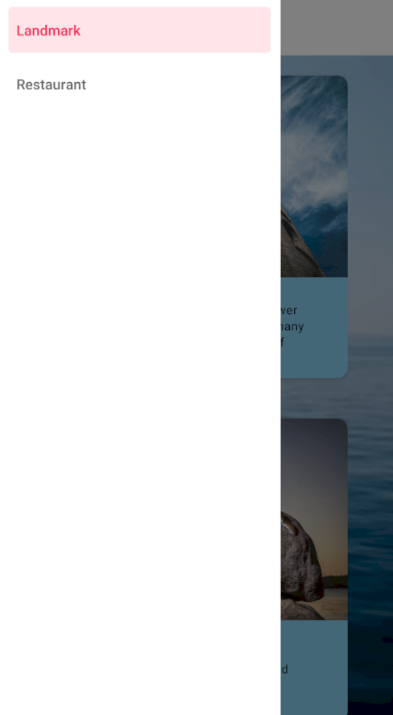

# CardComponent

A React Native project showcasing BottomTabNavigator and React Native Elements.

## Overview

This React Native project demonstrates the use of card components, a FlatList, and an ImageBackground to create an engaging mobile application.

## Features

- **Bottom Tab Navigator:** Implements a Bottom Tab Navigator for easy navigation between different sections of the app.
- **React Native Elements:** Utilizes the power of React Native Elements for enhanced UI components, icons, and styling.throughout the app.

## Preview



## Getting Started

Follow these steps to set up and run the project on your local machine.

### Prerequisites

- Node.js and npm installed
- Expo CLI installed (`npm install -g expo-cli`)

### Installation

1. Clone the repository:
   ```bash
   git clone https://github.com/ThuongNha/CardComponent.git
